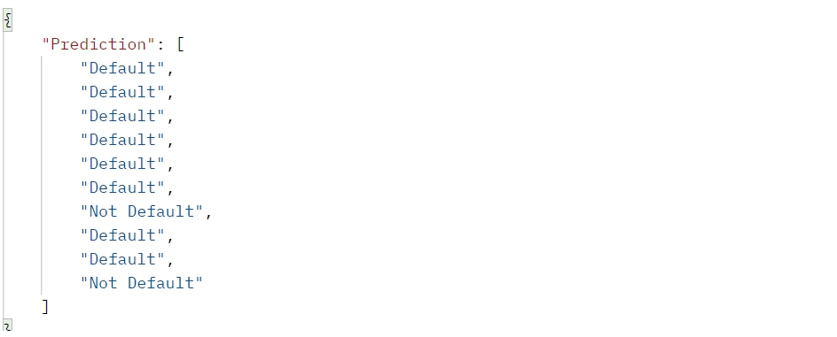

# Cara Testing main.py

<ol>
  <li> Download semua file yang ada </li>
  <li> Running main.py </li>
  <li> Buka postman </li>
  <li> Input data berbentuk json (testing.json) ke dalam postman.  
    Contoh : [   
    {"RevolvingUtilizationOfUnsecuredLines":null,"age":43,"NumberOfTime30-59DaysPastDueNotWorse":0,  
    "DebtRatio":0.177512717,"MonthlyIncome":5700.0,"NumberOfOpenCreditLinesAndLoans":4,"NumberOfTimes90DaysLate":0,"NumberRealEstateLoansOrLines":0,  
    "NumberOfTime60-89DaysPastDueNotWorse":0,"NumberOfDependents":0.0}   
    ] </li>
  <li> Send data </li>
</ol>

# Output

Setelah send data, output akan berbentuk: default or not default.

